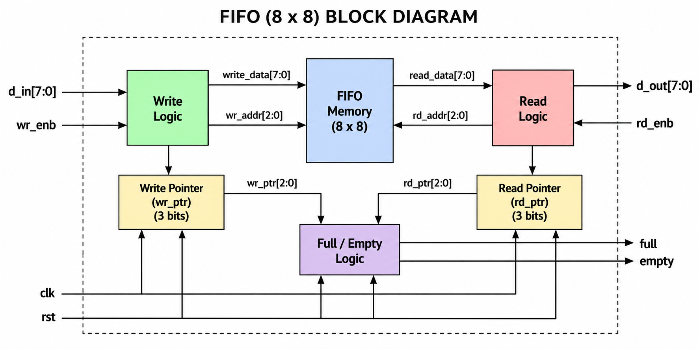
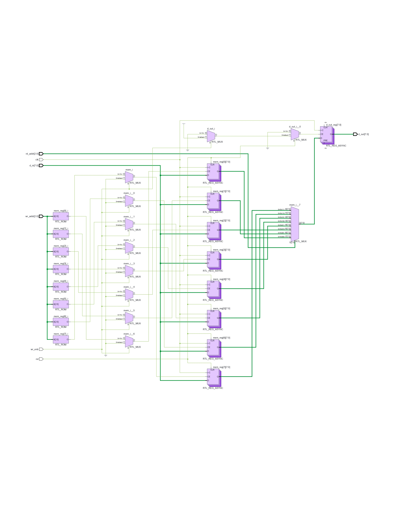
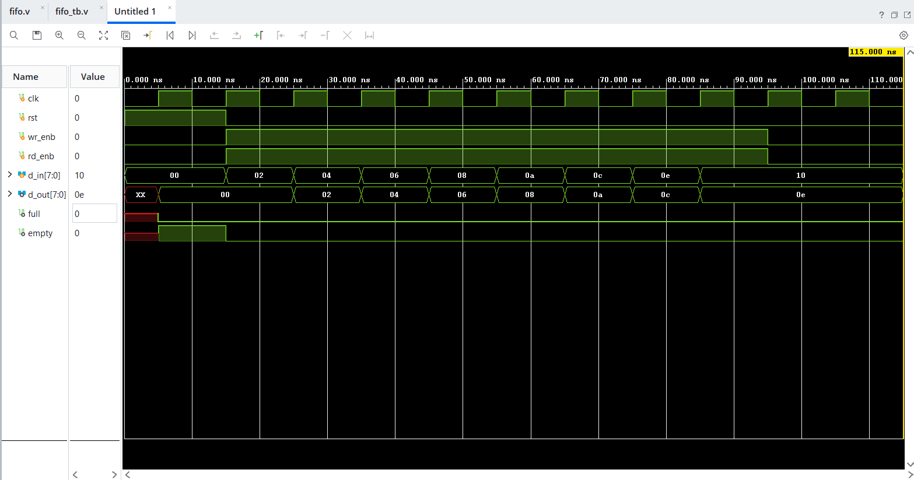
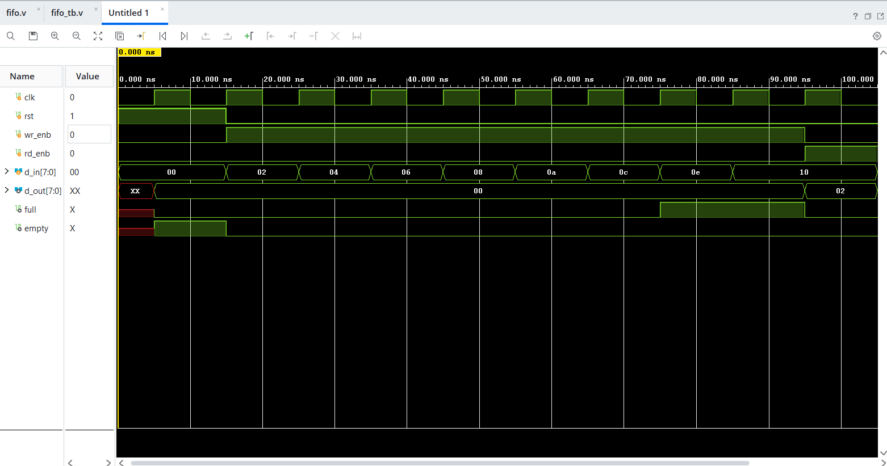
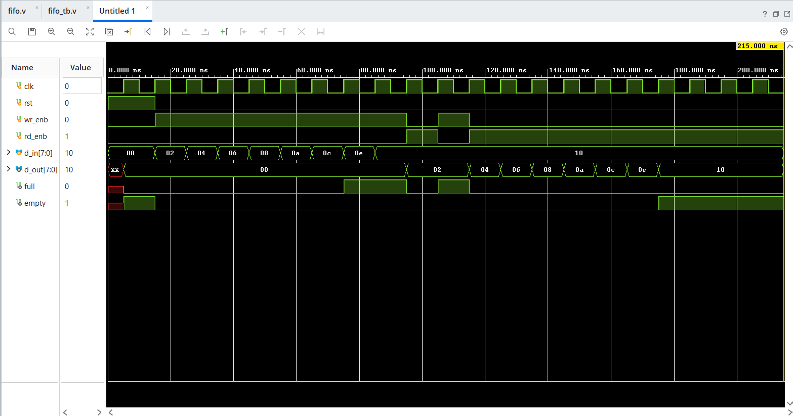
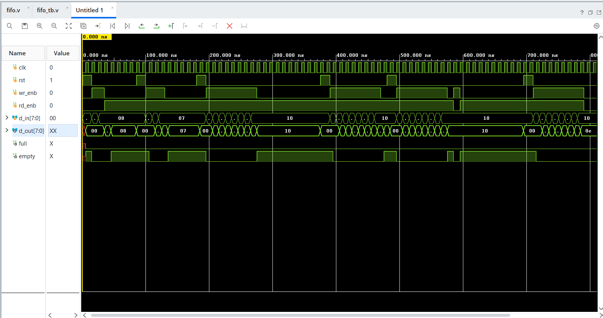

# FIFO RTL Design & Verification

## 1. Project Overview

This project presents the RTL design and verification of an **8-bit FIFO (First-In, First-Out) memory buffer** using Verilog HDL.

The verification was developed progressively, beginning with manual waveform-based verification and then moving to automated PASS/FAIL checking. The project also documents a simulation race condition encountered during verification and the timing-based solution used to resolve it.

## 2. Project Objectives

- Design a synchronous FIFO using Verilog HDL.
- Implement write/read operations using independent pointers.
- Generate `full` and `empty` status flags.
- Verify FIFO ordering and boundary conditions.
- Develop automated PASS/FAIL verification.
- Debug testbench timing and synchronization issues.
- Validate the RTL using AMD Vivado and its integrated simulation and waveform viewer.

## 3. FIFO Specifications

| Parameter | Value |
|---|---:|
| Data Width | 8 bits |
| Memory Depth | 8 locations |
| Clock | Single synchronous clock |
| Write Enable | `wr_enb` |
| Read Enable | `rd_enb` |
| Reset | `rst` |
| Data Input | `d_in[7:0]` |
| Data Output | `d_out[7:0]` |
| Write Pointer | 3 bits |
| Read Pointer | 3 bits |
| Status Flags | `full`, `empty` |

> **Implementation note:** The current 3-bit pointer/full-condition scheme reserves one memory location to distinguish full from empty. Therefore the practical FIFO capacity is **7 entries**.

## 4. FIFO Architecture

The FIFO consists of:

- FIFO memory array
- Write pointer
- Read pointer
- Write control logic
- Read control logic
- Full/empty detection logic
- Clock and reset control



## 5. RTL Schematic



## 6. FIFO Operation

### Write Operation

A write occurs on the rising edge of `clk` when:

```text
wr_enb = 1
full   = 0
```

The input is stored at the current write-pointer location:

```verilog
mem[wr_ptr] <= d_in;
```

The write pointer then advances.

### Read Operation

A read occurs on the rising edge of `clk` when:

```text
rd_enb = 1
empty  = 0
```

The current memory value is transferred to `d_out`:

```verilog
d_out <= mem[rd_ptr];
```

The read pointer then advances.

### FIFO Ordering

Data written first must be read first:

```text
Write:  2 → 4 → 6 → 8
Read:   2 → 4 → 6 → 8
```

## 7. Full and Empty Detection

### Empty

```verilog
assign empty = (wr_ptr == rd_ptr);
```

Therefore:

```text
wr_ptr == rd_ptr  →  empty = 1
```

### Full

```verilog
assign full = ((wr_ptr + 1'b1) == rd_ptr) ? 1'b1 : 1'b0;
```

When the next write position reaches the read pointer, the FIFO is considered full and further writes are blocked.

# 8. Verification Methodology

The verification followed this progression:

```text
RTL Design
    ↓
Manual Verification
    ↓
Automated Verification
    ↓
Debugging & Issue Resolution
    ↓
Final Verification
```

## 9. Stage 1 — Manual Verification

The FIFO was first verified manually using the Vivado waveform viewer.

Signals observed included:

```text
clk
rst
wr_enb
rd_enb
d_in
d_out
wr_ptr
rd_ptr
full
empty
```

The following behaviors were checked:

- Reset
- Single write/read
- FIFO ordering
- Full condition
- Write blocking when full
- Read from full
- Space recovery after read
- New write after read
- Simultaneous read/write

Manual waveform inspection established the basic RTL behavior before automated checking was introduced.

# 10. Stage 2 — Automated Verification

The testbench was then extended with automated PASS/FAIL checks.

Verification covered:

1. Reset condition
2. Single write
3. FIFO ordering
4. Full condition
5. Write blocking when full
6. Read from full
7. Space recovery after read
8. New write after space became available

This made the verification repeatable and reduced dependence on manual waveform inspection.

# 11. Verification Results

### Test 1 — Reset

```text
TEST 1 PASS : reset Condition met
```

### Test 2 — Single Write

```text
TEST 2 PASS : Single Write is done
```

### Test 3 — FIFO Ordering

Four FIFO ordering checks passed:

```text
TEST 3 PASS : Right FIFO Working
TEST 3 PASS : Right FIFO Working
TEST 3 PASS : Right FIFO Working
TEST 3 PASS : Right FIFO Working
```

### Test 4 — Full Condition

```text
TEST 4 PASS : FIFO FULL condition detected
TEST 4 PASS : Write blocked when FIFO is FULL
```

### Test 5 — Read From Full

```text
TEST 5 PASS : FIFO is FULL before read
TEST 5 PASS : Correct data read after FULL
TEST 5 PASS : FULL falls to 0 after one read
```

### Test 6 — Write After Read

```text
TEST 6 PASS : FIFO is FULL
TEST 6 PASS : Space available after read
TEST 6 PASS : New data written after space became available
```

## 12. Verification Summary

| Test | Verification | Result |
|---|---|---|
| 1 | Reset condition | PASS |
| 2 | Single write | PASS |
| 3 | FIFO ordering | PASS |
| 4 | Full condition and write blocking | PASS |
| 5 | Read from full FIFO | PASS |
| 6 | Write after read | PASS |

# 13. Verification Debugging — Race Condition

During automated verification, incorrect FIFO ordering was initially observed even though the RTL appeared correct during manual waveform inspection.

The issue was traced to **testbench timing rather than the FIFO datapath**.

The initial stimulus could change `d_in` immediately after:

```verilog
@(posedge clk);
```

The DUT and testbench were therefore reacting at the same clock edge. The DUT could sample the value intended for the next transaction.

This created a simulation race:

```text
Testbench changes input
        ↓
     posedge clk
        ↓
DUT samples input
```

## Solution

Stimulus was moved to the negative clock edge:

```verilog
@(negedge clk);
wr_enb = 1;
d_in = expected[i];

@(posedge clk);
#1;
```

The resulting timing relationship is:

```text
negedge clk                 posedge clk
     │                           │
     │ Drive stimulus            │ DUT samples
     ▼                           ▼
─────┴───────────────────────────┴──────
```

The `#1` delay allows the DUT's non-blocking assignments to update before the testbench performs its checks.

This removed the race condition and produced deterministic FIFO verification.

## 14. Verification Lesson

The debugging process demonstrated that a failing verification test does not necessarily indicate an RTL design error.

Important factors include:

- Testbench stimulus timing
- Clock-edge synchronization
- Non-blocking assignment timing
- Checking the DUT rather than only the stimulus
- Avoiding arbitrary delays as synchronization mechanisms

# 15. Simulation Waveforms

The repository contains separate Vivado waveform screenshots for the major FIFO behaviors.

### FIFO Ordering



Verifies that data is read in the same order in which it was written.

### Read From Full



Verifies correct retrieval when the FIFO is full and confirms that `full` falls after a read.

### Write After Read



Shows that a new write can occur after a read creates available space.

### Simultaneous Read/Write



Shows FIFO behavior during simultaneous read/write activity.

# 16. Tools Used

| Tool | Purpose |
|---|---|
| Verilog HDL | RTL design |
| AMD Vivado | RTL simulation, waveform analysis and design inspection |
| Git / GitHub | Version control and documentation |

# 17. Project Structure

```text
FIFO/
├── diagrams/
│   ├── block_diagram.png
│   └── rtl_schematic.png
│
├── docs/
│
├── rtl/
│   └── fifo.v
│
├── simulation/
│   └── waveforms/
│       ├── fifo_ordering.png
│       ├── read_from_full.png
│       ├── write_after_read.png
│       └── simultaneous_read_write.png
│
├── testbench/
│   └── fifo_tb.v
│
└── README.md
```

# 18. How to Run in Vivado

### Step 1 — Create/Open the Vivado Project

Add the RTL source and testbench to the Vivado project:

```text
rtl/fifo.v
testbench/fifo_tb.v
```

### Step 2 — Run Behavioral Simulation

In Vivado:

```text
Flow Navigator
    ↓
Simulation
    ↓
Run Simulation
    ↓
Run Behavioral Simulation
```

### Step 3 — Inspect the Waveform

Add the required signals to the Vivado waveform window, such as:

```text
clk
rst
wr_enb
rd_enb
d_in
d_out
wr_ptr
rd_ptr
full
empty
```

The waveform configuration can be saved as a Vivado `.wcfg` file for reuse.

### Step 4 — Run Automated Verification

Run the testbench through Vivado's simulator and observe the PASS/FAIL messages in the simulation console.

The automated testbench performs the verification checks described in this README.

# 19. Design Limitation

The current design uses:

```verilog
reg [7:0] mem [0:7];
reg [2:0] wr_ptr;
reg [2:0] rd_ptr;
```

With the current full-condition method, one location is reserved to distinguish full from empty. Consequently, the practical capacity is 7 entries.

A true 8-entry FIFO can be implemented using wider pointers with an additional wrap/phase bit.

# 20. Future Improvements

- Implement a true 8-entry FIFO using wrap/phase bits.
- Parameterize data width and FIFO depth.
- Add SystemVerilog assertions.
- Add a reference model and scoreboard.
- Add constrained/randomized verification.
- Add functional coverage.
- Extend the design toward synthesis and RTL-to-GDSII flow.

# 21. Key Learning Outcomes

This project provided practical experience in:

- Verilog RTL design
- Sequential logic
- Memory-based FIFO architecture
- Pointer-based control
- Full/empty flag generation
- Testbench development
- Automated PASS/FAIL verification
- GTKWave analysis
- Clock-edge synchronization
- Non-blocking assignment timing
- Simulation race-condition debugging
- RTL project organization

# 22. Author

**Sarath K**

M.Tech — VLSI Design

RTL Design & Verification Project
