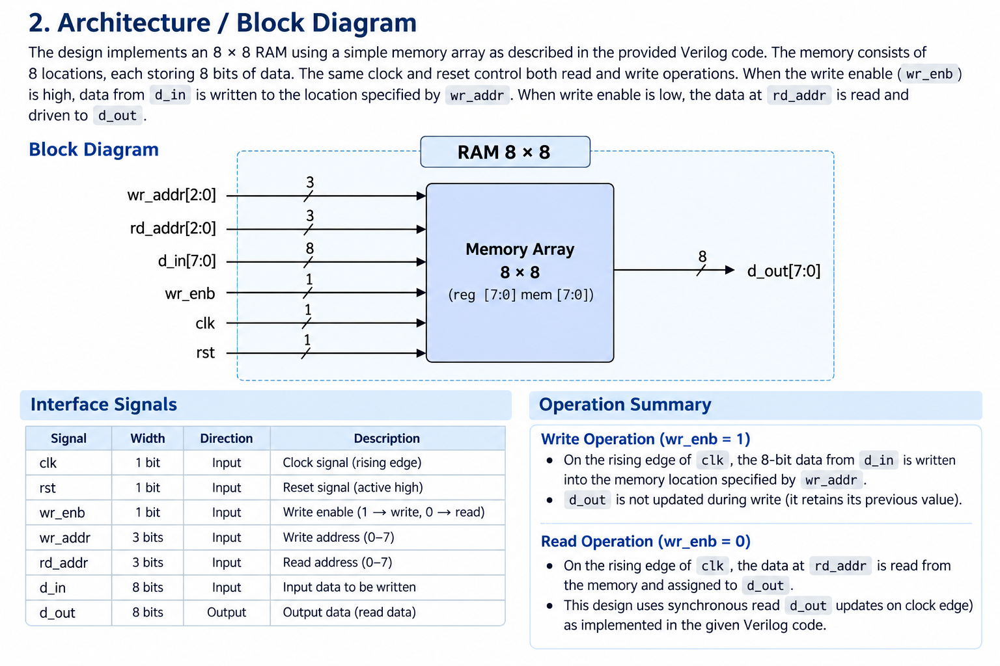
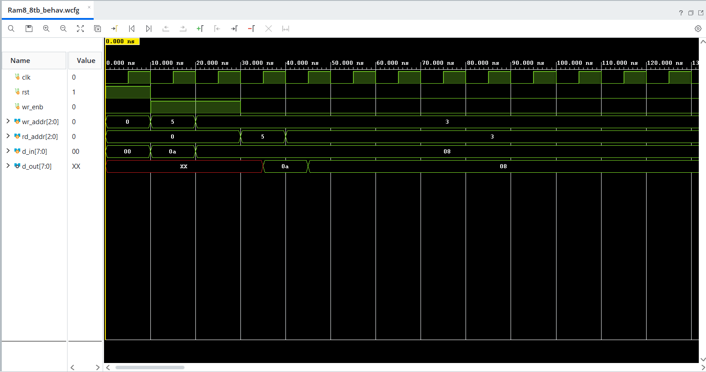

# RAM 8×8 — Verilog RTL Design & Verification

A Verilog-based 8×8 RAM design with functional verification and a planned RTL-to-GDSII physical design flow.

---

## 1. Project Overview

This project implements and verifies an 8×8 RAM using Verilog HDL.

The memory contains 8 addressable locations, with each location storing
8 bits of data. A 3-bit address is used to select a memory location,
while an 8-bit data bus is used for input and output.

The design supports synchronous read and write operations using separate
read and write addresses, along with an active-high asynchronous reset.

The project is structured to support further development through the
RTL-to-GDSII physical design flow.

---

## 2. Architecture / Block Diagram

The RAM consists of 8 memory locations, each capable of storing 8 bits.
The `wr_enb` signal determines whether a read or write operation is
performed on the rising edge of the clock.

### Operation

- `wr_enb = 1` → Write `d_in` to `mem[wr_addr]`
- `wr_enb = 0` → Read `mem[rd_addr]` to `d_out`
- `rst = 1` → Clear all memory locations

### Block Diagram



### Interface Signals

| Signal | Width | Direction | Description |
|---|---:|---|---|
| `clk` | 1 bit | Input | Clock |
| `rst` | 1 bit | Input | Active-high asynchronous reset |
| `wr_enb` | 1 bit | Input | `1` = Write, `0` = Read |
| `wr_addr` | 3 bits | Input | Write address |
| `rd_addr` | 3 bits | Input | Read address |
| `d_in` | 8 bits | Input | Input data |
| `d_out` | 8 bits | Output | Output data |

---

## 3. Memory Organization

The RAM is implemented using the following Verilog memory declaration:

```verilog
reg [7:0] mem [7:0];
```

This represents **8 memory locations × 8 bits**, giving a total storage
capacity of **64 bits (8 bytes)**.

### Address Mapping

| Address | Binary | Storage |
|---:|:---:|---:|
| 0 | `000` | 8 bits |
| 1 | `001` | 8 bits |
| 2 | `010` | 8 bits |
| 3 | `011` | 8 bits |
| 4 | `100` | 8 bits |
| 5 | `101` | 8 bits |
| 6 | `110` | 8 bits |
| 7 | `111` | 8 bits |

### Memory Configuration

| Parameter | Value |
|---|---:|
| Depth | 8 locations |
| Data Width | 8 bits |
| Address Width | 3 bits |
| Total Capacity | 64 bits |

---

## 4. RTL Design

The RAM is described using synthesizable Verilog HDL. The design
contains the memory array, reset logic, write logic, and read logic
within a sequential `always` block.

### RTL Structure

```text
                 ┌──────────────────────┐
                 │       RAM 8×8        │
                 │                      │
wr_addr[2:0] ───►│                      │
rd_addr[2:0] ───►│    Memory Array      │
d_in[7:0] ──────►│      8 × 8           │───► d_out[7:0]
wr_enb ─────────►│                      │
clk ────────────►│                      │
rst ────────────►│                      │
                 └──────────────────────┘
```

### RTL Operation

```text
wr_enb = 1  →  mem[wr_addr] <= d_in

wr_enb = 0  →  d_out <= mem[rd_addr]
```

The sequential logic is triggered by:

```verilog
always @(posedge clk or posedge rst)
```

Therefore:

- Read and write operations occur on the rising edge of `clk`.
- `rst` provides an active-high asynchronous reset.
- Reset clears all eight memory locations.

### RTL Source

[View Ram8_8.v](rtl/Ram8_8.v)

---

## 5. Verification / Testbench

The RAM functionality is verified using a dedicated Verilog testbench.

The testbench provides clock, reset, write-enable, address, and data
stimuli and observes the resulting output.

### Verification Sequence

| Step | Operation | Address | Data |
|---:|---|---:|---|
| 1 | Reset | — | Memory cleared |
| 2 | Write | `5` | `0A` |
| 3 | Write | `3` | `08` |
| 4 | Read | `5` | `0A` expected |
| 5 | Read | `3` | `08` expected |

### Expected Results

```text
RAM[5] = 0A
RAM[3] = 08
```

Read operations:

```text
Read Address 5 → d_out = 0A
Read Address 3 → d_out = 08
```

### Testbench Source

[View Ram8_8tb.v](testbench/Ram8_8tb.v)

---

## 6. Simulation Waveform

The RTL design was functionally simulated to verify the read and write
operations of the RAM.

### Waveform



### Waveform Interpretation

The simulation demonstrates the following operations:

```text
Write:
RAM[5] ← 0A
RAM[3] ← 08

Read:
RAM[5] → 0A
RAM[3] → 08
```

The waveform confirms that:

- `0A` is successfully written to address `5`.
- `08` is successfully written to address `3`.
- Reading address `5` produces `0A`.
- Reading address `3` produces `08`.

The initial `XX` values represent unknown/uninitialized memory values
before valid data is written or reset is applied.

**Functional Verification: PASS**

---

## 7. RTL / Schematic View

The RTL schematic provides a graphical representation of the hardware
structure inferred from the Verilog RTL.

It provides a visual representation of the design ports, memory logic,
control signals, and sequential elements generated during RTL elaboration.

### RTL Schematic


### RTL-to-Hardware Representation

```text
Verilog RTL
     ↓
RTL Elaboration
     ↓
RTL Schematic
     ↓
Hardware Representation
```

The schematic is generated using Vivado RTL elaboration.

---

## 8. Physical Design

The RTL design is intended to be taken through an RTL-to-GDSII physical
design flow using an open-source physical design toolchain.

### Planned Physical Design Flow

```text
RTL
 ↓
Synthesis
 ↓
Gate-Level Netlist
 ↓
Floorplanning
 ↓
Power Planning
 ↓
Placement
 ↓
Clock Tree Synthesis (CTS)
 ↓
Routing
 ↓
Static Timing Analysis (STA)
 ↓
GDSII
```

Physical design results will be added as the implementation progresses.

### Planned Results

The physical design stage will document:

- Synthesis results
- Area
- Timing
- Power
- Floorplan
- Placement
- Clock Tree Synthesis
- Routing
- Final GDSII layout

**Current Status:** Physical Design — Planned

---

## 9. Tools

| Tool | Purpose |
|---|---|
| Verilog HDL | RTL design |
| Vivado | RTL elaboration and simulation |
| Git | Version control |
| GitHub | Repository and documentation |
| OpenROAD | Planned physical design flow |

### Design Flow

```text
Verilog HDL
     ↓
RTL Simulation
     ↓
Functional Verification
     ↓
RTL Elaboration / Schematic
     ↓
Synthesis
     ↓
OpenROAD Physical Design
     ↓
GDSII
```

---

## 10. Project Structure

The repository is organized to separate RTL source files, verification
files, simulation results, diagrams, documentation, and future physical
design outputs.

```text
RAM8_8/
│
├── rtl/
│   └── RAM8_8.v
│
├── tb/
│   └── tb_RAM8_8.v
│
├── simulation/
│   └── waveform.png
│
├── diagrams/
│   ├── block_diagram.png
│   └── rtl_schematic.png
│
├── physical_design/
│   └── README.md
│
├── docs/
│   └── verification.md
│
└── README.md
```

### Directory Description

| Directory / File | Purpose |
|---|---|
| `rtl/` | Verilog RTL source |
| `tb/` | Verilog testbench |
| `simulation/` | Simulation results and waveforms |
| `diagrams/` | Block diagram and RTL schematic |
| `physical_design/` | Physical design files and results |
| `docs/` | Detailed project documentation |
| `README.md` | Project overview and technical summary |

---

## Project Status

| Stage | Status |
|---|---|
| RTL Design | ✅ Completed |
| Testbench | ✅ Completed |
| Functional Simulation | ✅ Completed |
| Waveform Verification | ✅ Completed |
| RTL Schematic | 🔄 In Progress |
| Synthesis | ⏳ Planned |
| Floorplanning | ⏳ Planned |
| Placement | ⏳ Planned |
| CTS | ⏳ Planned |
| Routing | ⏳ Planned |
| GDSII | ⏳ Planned |
